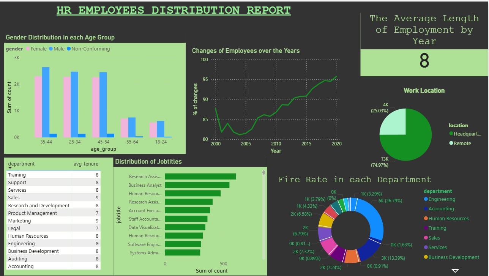

# Employee-Distribution-Report
This project demonstrates a complete data workflow: I imported raw datasets into MySQL Workbench, wrote SQL scripts to clean, normalize, and validate the data (including handling missing or invalid values), then exported the cleaned tables into Power BI Desktop to build interactive dashboards.

## Power BI Dashboard Preview

# Questions and Answers
1. What is the gender breakdown of employees in the company?
2. What is the age distribution of employees in the company?
3. How many employees work at headquarters versus remote locations?
4. What is the average length of employment for employees who have been terminated?
5. What is the distribution of job titles across the company?
6. How has the company's employee count changed over time based on hire and term dates?
7. What is the tenure distribution for each department?
